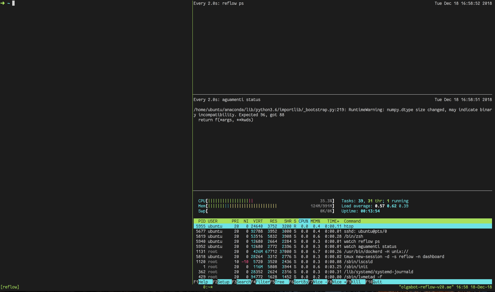

**How to set up Reflow**
------------------------

## Run reflow on an AWS instance (recommended)

1. Launch an aegea instance with reflow

	Most likely, you'll want to run the workflow and walk away from it. Launch an aegea instance with reflow pre-installed on it. Make sure to change `$USERNAME` to your own AWS username, otherwise `aegea` will complain.

	```
	aegea launch --iam-role S3fromEC2 --ami-tags Name=czbiohub-reflow -t t2.micro  '$USERNAME-reflow'
	```

	If you're getting an error about `dns`, try this:


	```
	aegea launch --iam-role S3fromEC2 --ami-tags Name=czbiohub-reflow -t t2.micro --no-dns '$USERNAME-reflow'
	```

2. Now ssh into your instance

	We recommend using [iTerm2](https://www.iterm2.com/) for this as the 

	```
	aegea ssh ubuntu@olgabot-reflow
	```

	This will automatically launch a `tmux` session with `tmuxinator start reflow`, and should look like this:

	


3. Create a batch and write it to the reflow-batches

	```
	aguamenti rnaseq-align \
		--output ~/reflow-batches/rnaseq/mus/20181030_FS10000331_12_BNT40322-1214/ \ 
		$EXPT_ID $TAXON s3://olgabot-maca/aguamenti-test/
	```

	Equivalently, you could assign bash variables to `EXPT_ID` and `TAXON` to make the output a little more readable:
	```
	EXPT_ID=20181030_FS10000331_12_BNT40322-1214
	TAXON=mus
	aguamenti rnaseq-align \
		--output ~/reflow-batches/rnaseq/$TAXON/$EXPT_ID \
		$EXPT_ID $TAXON s3://olgabot-maca/aguamenti-test/
	```

4. Change to the directory and run the batch!

	```
	cd ~/reflow-batches/rnaseq/mus/20181030_FS10000331_12_BNT40322-1214/
	```

	There should be both a `samples.csv` and `config.json` file there:

	```
	➜  20181030_FS10000331_12_BNT40322-1214 git:(master) ll
	Permissions Size User   Date Modified Git Name
	.rw-rw-r--    93 ubuntu 18 Dec 17:48   -- config.json
	.rw-rw-r--   49k ubuntu 18 Dec 17:48   -- samples.csv
	```

	To run the batch, do `reflow runbatch`!

5. Commit the changes and push to reflow batches ONCE. After this, it will push every hour automatically, but first it needs to store your username and password, which is why you need to enter it this first time

	First, tell git your name and email, otherwise it's assumed to be `ubuntu` which is lame.
	
	```
	git config --global user.name "Rosalind Franklin"
	git config --global user.email "you@email.com"
	```

	Now you're ready to push your changes!

	```
	git add -A .
	git commit -m "Added mus RNA-seq run for $EXPT_ID"
	# Get any updated changes before pushing
	git pull && git push
	```

To see how this image was built and set up if you want to use some of the info for your own, check out the [czbiohub/packer-images/reflow.json](https://github.com/czbiohub/packer-images/blob/master/reflow.json) recipe and [czbiohub/packer-images/scripts/reflow.sh](https://github.com/czbiohub/packer-images/tree/master/scripts) script.


## Set up reflow on your local computer

Run `aws configure` and input your credentials. If you're on an aegea instance, run 'ssh-keygen' to generate a new ssh key.

Now configure reflow with the following commands:

``` syntaxhighlighter-pre
AWS_SDK_LOAD_CONFIG=1 reflow setup-ec2
AWS_SDK_LOAD_CONFIG=1 reflow setup-s3-repository czbiohub-reflow-quickstart-cache
AWS_SDK_LOAD_CONFIG=1 reflow setup-dynamodb-assoc czbiohub-reflow-quickstart
```

Set your AWS Region:

``` syntaxhighlighter-pre
export AWS_REGION=us-west-2
```

The reflow config file (which you can view with\``reflow config`) should now contain the following lines:

``` syntaxhighlighter-pre
securitygroup: sg-661d7f19
repository: s3,czbiohub-reflow-quickstart-cache
```


### How to increase your number of open files

Since running `reflow runbatch` will open one or more files per sample, and many systems have hard limits on the number of files open at `4096` , so you'll want to change your number of open files limits. <a href="https://underyx.me/2015/05/18/raising-the-maximum-number-of-file-descriptors" class="external-link">This blog post</a> (excerpted below) explains how to do this. I set it to 2 million open files.

**The Stuff You Came Here to Read: Raising the Limit**

Sorry it took this long to get here! The `ulimit -n 2000000` command that’s floating around, as every easy ‘solution’, will not actually fix your problem. The issue is that the command only raises your limit for the active shell session, so it’s not permanent, and it most definitely will not affect your processes that are already running (actually, nothing will, so don’t have high expectations here.)

The actual way to raise your descriptors consists of editing three files:

-   `/etc/security/limits.conf` needs to have these lines in it:

``` syntaxhighlighter-pre
*    soft nofile 2000000
*    hard nofile 2000000 
root soft nofile 2000000 
root hard nofile 2000000
```

-   The asterisk at the beginning of the first two lines means ‘apply this rule to all users except root’, and you can probably guess that the last two lines set the limit only for the root user. The number at the end is of course, the new limit you’re setting. 2000000 is a pretty safe number to use- `/etc/pam.d/common-session` needs to have this line in it:
    `session required pam_limits.so `- `/etc/pam.d/common-session-noninteractive` also needs to have this line in it:
    `session required pam_limits.so `

I never got around to looking into what exactly this does, but I’d assume that these two files control whether the limits file you edited above is actually read at the beginning of your sessions.

So, you did it, great job! Just reboot the machine (yup, sadly, you need to \[e.g. with `aegea reboot olgabot-reflow` - Olga\]) and your limits should reflect your changes:

``` syntaxhighlighter-pre
$ ulimit -n
2000000
$ ulimit -Hn
2000000
$ ulimit -Sn
2000000
```
